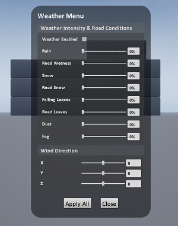

# Welcome to AirSim

This project is based on [AirSim](https://microsoft.github.io/AirSim/), a popular drone simulation platform. The project is developed as a UE4 plugin, creating a GameMode to load the simulation game. However, Microsoft did not provide a simulation with both a car and an aircraft simultaneously. To better adapt to the simulation of target tracking algorithms, we conducted secondary development to create a multiplayer game that allows for simultaneous control of both aircraft and car models.

# Develop UE game in Windows and Package game to Linux

### Windows

Build AirSim#
Install Visual Studio 2022. Make sure to select Desktop Development with C++ and Windows 10 SDK 10.0.19041 (should be selected by default) and select the latest .NET Framework SDK under the 'Individual Components' tab while installing VS 2022.
Start Developer Command Prompt for VS 2022.
Clone the repo: git clone https://github.com/9woods123/simulator.git, and go the AirSim directory by cd AirSim.

Note: It's generally not a good idea to install AirSim in C drive. This can cause scripts to fail, and requires running VS in Admin mode. Instead clone in a different drive such as D or E.

Run build.cmd from the command line. This will create ready to use plugin bits in the Unreal\Plugins folder that can be dropped into any Unreal project.

## Build Project to Linux Platform

To package the simulation software for Linux, you need to convert the `.uproject` into a C++ project and then recompile it on Linux with the AirSim Plugin, including the dynamic link libraries `libxxx.a`, to achieve cross-compilation. The main logic is to maintain the UE4 Windows project while copying the `libAirLib.a`, `libMavLinkCom.a`, and `librpc.a` files to the appropriate locations since they are required during the UE4 packaging process.

1. Install WSL with the following command:
   ```
   wsl --install -d Ubuntu-18.04
   ```
   Then, restart your machine.

2. After rebooting, execute the command again to create a new user account:
   ```
   wsl --install -d Ubuntu-18.04
   ```

3. Once inside the Ubuntu subsystem, run:
   ```bash
   sudo apt-get update
   sudo apt-get install dos2unix
   cd Airsim/ && dos2unix build.sh && dos2unix setup.sh
   cd Unreal/Environments/Blocks/ && dos2unix clean.sh
   ```
   This converts all necessary files.

4. In the **Windows Developer Command Prompt for VS 2022**, navigate to the AirSim directory and build the project:
   ```cmd
   cd Airsim/ && build.cmd
   ```
   This will generate a `Block.uproject` that can be opened on Windows. Open the `.uproject` file to let UE4 recompile `Block.uproject`.

5. Return to the AirSim directory and set up the Linux environment:
   ```bash
   ./setup.sh  # Install dependencies for compiling AirSim on Linux
   ./build.sh  # Compile AirSim; this will create an AirSim uproject for Ubuntu
   ```

6. However, since you need to handle the `Block.uproject` on Windows, Linux compilation alone isn’t sufficient. The purpose of compiling AirSim on Linux is to obtain a few essential dynamic link libraries (executing `build.sh` will copy some libraries directly to the `AirSim/Unreal/Plugins/AirSim/Source/AirLib/lib` directory). At this point, the `block.uproject` is still configured for Linux.

7. Therefore, re-run:
   ```cmd
   cd Airsim/ && build.cmd
   ```
   Open `Block.uproject` to let UE4 recompile it again on Windows. Then, copy `libMavLinkCom.a` to the `Block/Plugins/AirSim/Source/AirLib/deps/MavLinkCom/lib` directory.

8. If you want to use this plugin, copy the `Plugins` folder to the directory at the same level as the `Content` folder within your project. After opening the `.uproject`, create a new C++ file (this will trigger UE4 to recompile the Plugins during the packaging process). Since the necessary dynamic link libraries have been added to the Plugins folder, packaging should proceed without issues.


# use ./build.sh --debug to build in debug mode
# go to the folder where you clone GitHub projects
git clone -b 4.27 git@github.com:EpicGames/UnrealEngine.git
cd UnrealEngine
./Setup.sh
./GenerateProjectFiles.sh
make

Build AirSim#
Clone AirSim and build it:
# go to the folder where you clone GitHub projects
git clone https://github.com/Microsoft/AirSim.git
cd AirSim
By default AirSim uses clang 8 to build for compatibility with UE 4.27. The setup script will install the right version of cmake, llvm, and eigen.

./setup.sh
./build.sh


## How to Use It

### Documentation

View our [detailed documentation](https://microsoft.github.io/AirSim/) on all aspects of AirSim.

### Manual drive

If you have remote control (RC) as shown below, you can manually control the drone in the simulator. For cars, you can use arrow keys to drive manually.

[More details](https://microsoft.github.io/AirSim/remote_control)


### Programmatic control

AirSim exposes APIs so you can interact with the vehicle in the simulation programmatically. You can use these APIs to retrieve images, get state, control the vehicle and so on. The APIs are exposed through the RPC, and are accessible via a variety of languages, including C++, Python, C# and Java.

These APIs are also available as part of a separate, independent cross-platform library, so you can deploy them on a companion computer on your vehicle. This way you can write and test your code in the simulator, and later execute it on the real vehicles. Transfer learning and related research is one of our focus areas.

Note that you can use [SimMode setting](https://microsoft.github.io/AirSim/settings#simmode) to specify the default vehicle or the new [ComputerVision mode](https://microsoft.github.io/AirSim/image_apis#computer-vision-mode-1) so you don't get prompted each time you start AirSim.

[More details](https://microsoft.github.io/AirSim/apis)

### Gathering training data

There are two ways you can generate training data from AirSim for deep learning. The easiest way is to simply press the record button in the lower right corner. This will start writing pose and images for each frame. The data logging code is pretty simple and you can modify it to your heart's content.


A better way to generate training data exactly the way you want is by accessing the APIs. This allows you to be in full control of how, what, where and when you want to log data.

### Computer Vision mode

Yet another way to use AirSim is the so-called "Computer Vision" mode. In this mode, you don't have vehicles or physics. You can use the keyboard to move around the scene, or use APIs to position available cameras in any arbitrary pose, and collect images such as depth, disparity, surface normals or object segmentation.

[More details](https://microsoft.github.io/AirSim/image_apis)

### Weather Effects

Press F10 to see various options available for weather effects. You can also control the weather using [APIs](https://microsoft.github.io/AirSim/apis#weather-apis). Press F1 to see other options available.



## Tutorials

- [Video - Setting up AirSim with Pixhawk Tutorial](https://youtu.be/1oY8Qu5maQQ) by Chris Lovett
- [Video - Using AirSim with Pixhawk Tutorial](https://youtu.be/HNWdYrtw3f0) by Chris Lovett
- [Video - Using off-the-self environments with AirSim](https://www.youtube.com/watch?v=y09VbdQWvQY) by Jim Piavis
- [Webinar - Harnessing high-fidelity simulation for autonomous systems](https://note.microsoft.com/MSR-Webinar-AirSim-Registration-On-Demand.html) by Sai Vemprala
- [Reinforcement Learning with AirSim](https://microsoft.github.io/AirSim/reinforcement_learning) by Ashish Kapoor
- [The Autonomous Driving Cookbook](https://aka.ms/AutonomousDrivingCookbook) by Microsoft Deep Learning and Robotics Garage Chapter
- [Using TensorFlow for simple collision avoidance](https://github.com/simondlevy/AirSimTensorFlow) by Simon Levy and WLU team

## Participate

### Paper

More technical details are available in [AirSim paper (FSR 2017 Conference)](https://arxiv.org/abs/1705.05065). Please cite this as:
```
@inproceedings{airsim2017fsr,
  author = {Shital Shah and Debadeepta Dey and Chris Lovett and Ashish Kapoor},
  title = {AirSim: High-Fidelity Visual and Physical Simulation for Autonomous Vehicles},
  year = {2017},
  booktitle = {Field and Service Robotics},
  eprint = {arXiv:1705.05065},
  url = {https://arxiv.org/abs/1705.05065}
}
```

### Contribute

Please take a look at [open issues](https://github.com/microsoft/airsim/issues) if you are looking for areas to contribute to.

* [More on AirSim design](https://microsoft.github.io/AirSim/design)
* [More on code structure](https://microsoft.github.io/AirSim/code_structure)
* [Contribution Guidelines](CONTRIBUTING.md)

### Who is Using AirSim?

We are maintaining a [list](https://microsoft.github.io/AirSim/who_is_using) of a few projects, people and groups that we are aware of. If you would like to be featured in this list please [make a request here](https://github.com/microsoft/airsim/issues).

## Contact

Join our [GitHub Discussions group](https://github.com/microsoft/AirSim/discussions) to stay up to date or ask any questions.

We also have an AirSim group on [Facebook](https://www.facebook.com/groups/1225832467530667/). 


## What's New

* [Cinematographic Camera](https://github.com/microsoft/AirSim/pull/3949)
* [ROS2 wrapper](https://github.com/microsoft/AirSim/pull/3976)
* [API to list all assets](https://github.com/microsoft/AirSim/pull/3940)
* [movetoGPS API](https://github.com/microsoft/AirSim/pull/3746)
* [Optical flow camera](https://github.com/microsoft/AirSim/pull/3938)
* [simSetKinematics API](https://github.com/microsoft/AirSim/pull/4066)
* [Dynamically set object textures from existing UE material or texture PNG](https://github.com/microsoft/AirSim/pull/3992)
* [Ability to spawn/destroy lights and control light parameters](https://github.com/microsoft/AirSim/pull/3991)
* [Support for multiple drones in Unity](https://github.com/microsoft/AirSim/pull/3128)
* [Control manual camera speed through the keyboard](https://github.com/microsoft/AirSim/pulls?page=6&q=is%3Apr+is%3Aclosed+sort%3Aupdated-desc#:~:text=1-,Control%20manual%20camera%20speed%20through%20the%20keyboard,-%233221%20by%20saihv) 

For complete list of changes, view our [Changelog](docs/CHANGELOG.md)

## FAQ

If you run into problems, check the [FAQ](https://microsoft.github.io/AirSim/faq) and feel free to post issues in the  [AirSim](https://github.com/Microsoft/AirSim/issues) repository.

## Code of Conduct

This project has adopted the [Microsoft Open Source Code of Conduct](https://opensource.microsoft.com/codeofconduct/). For more information see the [Code of Conduct FAQ](https://opensource.microsoft.com/codeofconduct/faq/) or contact [opencode@microsoft.com](mailto:opencode@microsoft.com) with any additional questions or comments.


## License

This project is released under the MIT License. Please review the [License file](LICENSE) for more details.


